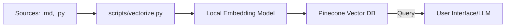

# Architecture: Knowledge Architect RAG

## 🧩 RAG Flow
The system follows a modern RAG (Retrieval-Augmented Generation) pipeline:

1. **Crawl & Collect**: Data is collected from various sources (currently manual markdown/code files, extensible to `Crawl4AI`).
2. **Processing**: Files are chunked and processed by `scripts/vectorize.py`.
3. **Embedding**: Text chunks are converted into vectors using `sentence-transformers` (local/free).
4. **Vector Store**: Embeddings are upserted into **Pinecone** with specific metadata and namespaces.

## 🏷️ Metadata Schema
To ensure strict context separation, we use **Namespaces**:

- `work-context`: Corporate environment (TOTVS, SQL, Governance).
- `home-context`: Personal projects (Home Lab, JS, Lua, Python).

**Metadata Fields:**
- `source`: Filename.
- `type`: `documentation` or `code-snippet`.
- `filename`: Full basename.
- `chunk_index`: Sequence in document for retrieval reconstruction.

## 🛡️ Security Model
- **Zero Hardcoding**: No API keys are stored in the codebase.
- **Local Environment**: Uses `.env` via `python-dotenv` for local development.
- **CI/CD Security**: GitHub Actions use **GitHub Secrets** for `PINECONE_API_KEY` and `PINECONE_INDEX_NAME`.
- **Pre-commit Hooks**: Automated checks for secret detection before any commit.

## 🔄 Disaster Recovery: Credential Rotation
If credentials (Pinecone API Key) are compromised:
1. **Revoke**: Generate a new key in the Pinecone Console and revoke the old one.
2. **Update Secrets**: Update the `PINECONE_API_KEY` secret in GitHub Actions.
3. **Local Update**: Update personal `.env` files (ensuring they are never committed).
4. **Audit**: Review recent GitHub Action runs and Pinecone access logs.
